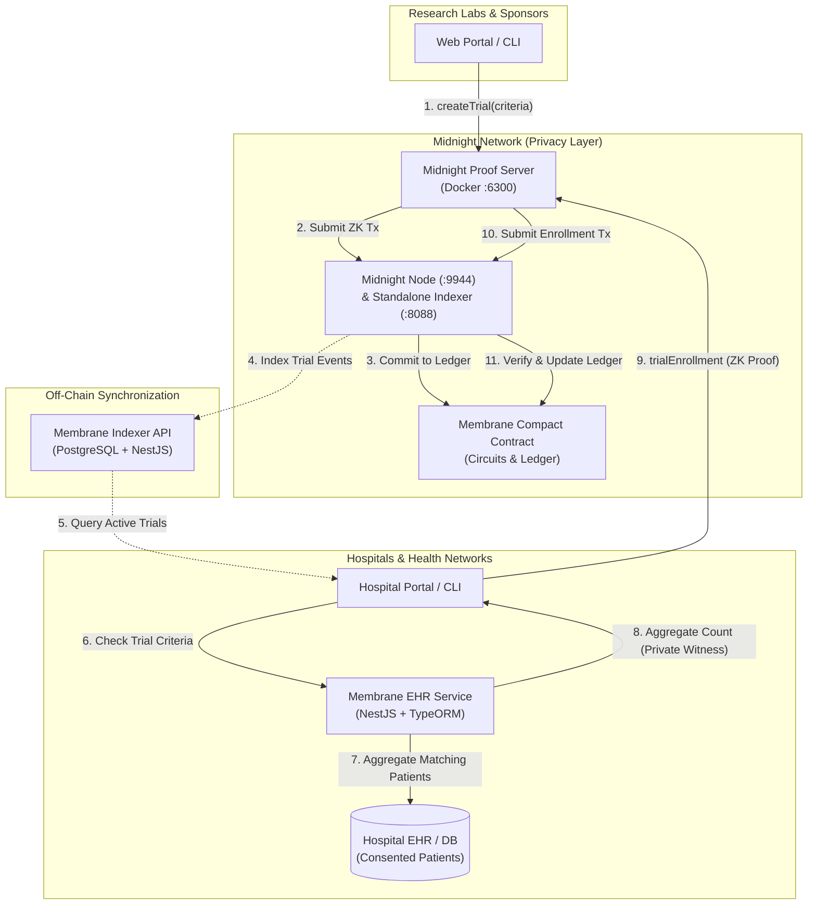

# Membrane Architecture & System Design

Membrane is a privacy-preserving decentralized application (DApp) and infrastructure for **clinical trials and hospital cohort recruitment**, built on the **Midnight Network** (a zero-knowledge privacy blockchain by IOG).

---

## 1. Problem Statement & Motivation

Clinical trials are critical for biomedical progress, yet over **80% of clinical trials fail to recruit sufficient patient cohorts on schedule**. The primary bottlenecks are:

* **Siloed Patient Health Information (PHI)**: Regulatory frameworks such as HIPAA (US) and GDPR (EU) strictly prohibit hospitals from exposing patient data to third-party research institutions.
* **Lack of Verifiable Availability**: Research sponsors often commit significant funding without knowing if a partner hospital truly possesses a statistically viable cohort.
* **Information Asymmetry**: Hospitals risk disclosing competitive patient demographic insights or intellectual property when negotiating trial partnerships.

**Membrane resolves this dilemma using Zero-Knowledge Proofs (ZKPs):**
Hospitals can mathematically prove to trial sponsors that they possess a compliant, consented cohort meeting all inclusion criteria (disease classification, age parameters, and minimum sample size) **without exposing any individual patient data, names, or even the exact cohort size.**

---

## 2. High-Level System Architecture



---

## 3. Core Actors & Interactions

### 3.1 Research Labs (Trial Sponsors)
* **Define Trials**: Publish a trial on-chain specifying:
  * `diseaseCode`: Standardized ICD diagnosis code (e.g., `E11` for Type 2 Diabetes, `I10` for Essential Hypertension).
  * `minAge` & `maxAge`: Patient eligibility boundaries.
  * `minPatientSampleCount`: Minimum statistical sample size required.
* **Cryptographic Identity**: Generates a private trial tag and cryptographic identity derived via `persistentHash` using domain separation.
* **Lifecycle Management**: Can decommission trials (`cancelTrial`) when recruitment concludes.

### 3.2 Hospitals & Healthcare Providers
* **Local EHR Evaluation**: Queries internal consented patient databases matching the trial criteria.
* **Zero-Knowledge Enrollment**: Passes the aggregated count as a private witness into the Midnight proof server.
* **ZK Circuit Verification**: The circuit evaluates:
  $$\text{patientAggregateCount} \ge \text{minPatientSampleCount}$$
  The blockchain receives only the mathematical proof of satisfaction and the hospital's derived public tag, guaranteeing:
  1. No patient records leave the hospital premises.
  2. The exact number of patients beyond the minimum remains confidential.
  3. Hospital identity is pseudonymous on-chain.

---

## 4. Smart Contract Design (`membrane.compact`)

The smart contract is authored in Midnight's domain-specific language **Compact** (v0.31+).

### 4.1 Ledger State Structure

```typescript
struct TrialInfo {
  diseaseCode: Opaque<"string">,
  minAge: Uint<8>,
  maxAge: Uint<8>,
  minPatientSampleCount: Uint<16>,
  status: TrialStatusEnum,       // active | inactive
  enrolledCount: Uint<16>,
  researchLabIdHash: Bytes<32>,
  trialIdHash: Bytes<32>,
};

export ledger trialCounter: Counter;
export ledger activeTrials: Map< Bytes<32>, TrialInfo >;
export ledger inactiveTrials: Map< Bytes<32>, TrialInfo >;
export ledger trialsEnrollments: Map< Bytes<32>, Set<Bytes<32>> >;
```

### 4.2 Circuits & Witnesses

| Circuit | Visibility | Role & Constraints |
| :--- | :--- | :--- |
| `createTrial` | Public output | Validates constraints (`minPatientSampleCount > 0`, `maxAge >= minAge`). Inserts `TrialInfo` into `activeTrials`. Returns `trialIdHash`. |
| `cancelTrial` | Public output | Validates that caller's derived public key matches `researchLabIdHash`. Moves record to `inactiveTrials`. |
| `trialEnrollment` | Public output | Asserts `patientAggregateCount >= minPatientSampleCount`. Adds hospital tag to `trialsEnrollments` and increments `enrolledCount`. |
| `validateTrialEnrollment` | Public output | Proves a hospital's enrollment status without revealing private keys. |
| `isTrialActive` | Read circuit | Checks if a given `trialIdHash` exists in `activeTrials`. |
| `activeTrialDetail` | Read circuit | Returns `TrialInfo` for an active trial. |

**Witnesses (Private Inputs):**
* `witness getPrivateKey(): Bytes<32>`: Private signing key for hospital or research lab.
* `witness getPrivateTrialTag(): Bytes<32>`: Salt used to derive the unique `trialIdHash`.
* `witness getHospitalPatientsAggregate(): Uint<16>`: The hospital's internally computed patient count matching trial criteria.

---

## 5. Backend Architecture (`membrane-api/`)

The off-chain API is built with **NestJS 11**, **TypeORM**, and **PostgreSQL**.

### 5.1 Modules

1. **`ClinicalTrialsModule`**:
   * Indexes on-chain clinical trials (`trialHexId`, `diseaseCode`, metadata).
   * Provides paginated listing and filtering for hospital interfaces.
2. **`DemoAHospitalDataModule`**:
   * Simulates an enterprise Hospital Information System (HIS) / Electronic Health Record (EHR).
   * Automatically bootstraps realistic synthetic patient records with 50+ ICD disease codes and varied demographics.
   * Exposes `getPatientTrialRequirementCount(diseaseCode, minAge, maxAge)`: Calculates candidate patient count directly for zero-knowledge witness generation.

---

## 6. Security, Compliance & Cryptographic Guarantees

* **Zero Health Data Exposure**: PHI never touches the public network, API indexers, or proof transactions.
* **Deterministic Domain Separation**: Public keys and trial identifiers are hashed using domain prefixes (`membrane:identity` and `membrane:trialTag`) to prevent cross-protocol replay attacks.
* **Zero-Knowledge Witness Confidentiality**: The Midnight Proof Server runs locally in an isolated container (`docker :6300`), ensuring private state never traverses external networks.
